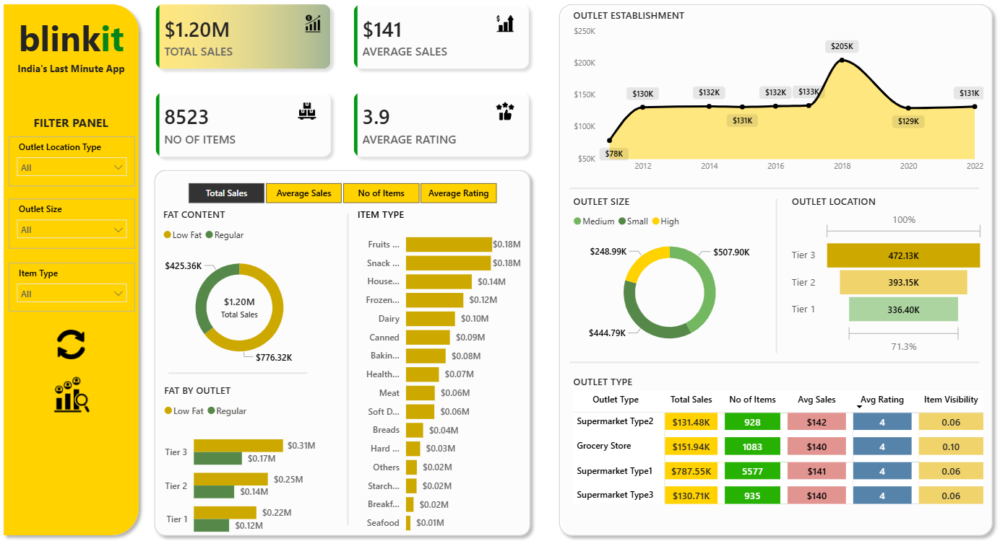
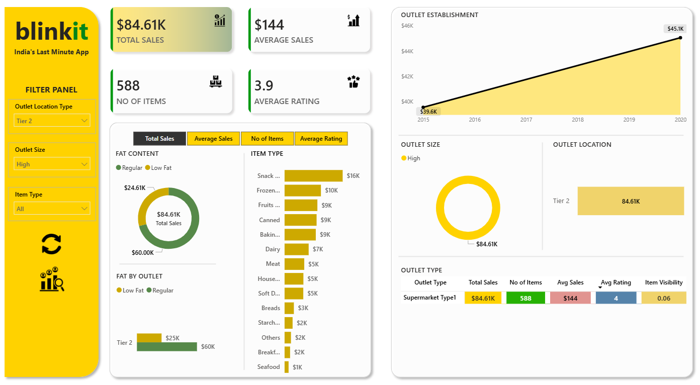
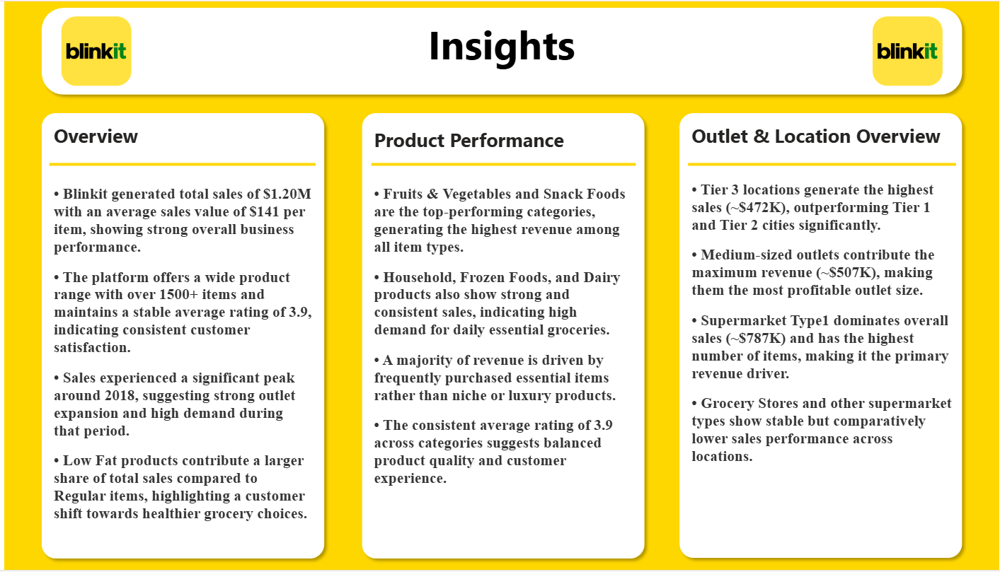

# 🛒 Blinkit Power BI Dashboard | Sales & Performance Analysis

---

## 📌 Project Overview

This project presents an interactive Power BI dashboard developed to analyze Blinkit's sales performance, outlet distribution, and product-level insights.

The dashboard provides dynamic KPIs and visual analysis to help understand business performance across different outlet sizes, locations, and product categories.

Key metrics analyzed include Total Sales, Average Sales, Number of Items Sold, Average Rating, Outlet Performance, Item Type contribution, and Location-based revenue distribution.

---

## 🌐 🔗 Live Interactive Dashboard

Click below to explore the live dashboard:

👉 **[View Live Power BI Dashboard](https://app.powerbi.com/view?r=eyJrIjoiNDJiNTkyMTktMmJjZS00M2MwLWJkNGQtMjI5NzlhYjZkNjgyIiwidCI6ImIyZDFjYmQyLWYwMTctNDUyMC04NjA4LThkMjIyNmJlNTkyYSJ9&pageName=3a12896bc03acfc67f08)**

---

## 🖥️ Dashboard Preview (Public Screenshots)

### 📊 Main Dashboard Overview

This dashboard provides a complete business overview including:

- 💰 Total Sales: **$1.20M**
- 📦 Total Items Sold: **8523**
- 📊 Average Sales per Item: **$141**
- ⭐ Average Rating: **3.9**
- 📈 Outlet Establishment trend analysis
- 🛍️ Item Type & Fat Content distribution
- 🏪 Outlet Location and Outlet Size performance comparison

---

### 📈 Sales Analysis View (Filtered by Outlet Location Type)

This filtered dashboard demonstrates:

- Tier 2 outlet sales performance: **$393.15K**
- 2,785 items sold within Tier 2
- Dynamic KPI updates based on slicer selections
- Supermarket Type 1 leading sales within Tier 2
- Category-wise contribution across selected outlet type

---

## 📊 Key Business Insights

* 📍 Total sales reached **$1.20M**, indicating strong overall business performance.
* 🏪 Tier 3 outlets contribute the highest total revenue (~$472K).
* 📦 Medium-sized outlets generate the maximum revenue (~$507K).
* 🛒 Fruits, Snacks, and Household items are top-performing categories.
* ⭐ Average rating of **3.9** reflects stable customer satisfaction.
* 📈 Sales peaked around 2018, suggesting strong outlet expansion impact.

---

## 🛠️ Tools & Technologies Used

| Tool        | Purpose                                    |
| ----------- | ------------------------------------------ |
| Power BI    | Data Visualization & Dashboard Development |
| DAX         | Calculated Measures & KPIs                 |
| Power Query | Data Cleaning & Transformation             |
| Dataset     | Business Data Analysis                     |

---

## 📂 Repository Structure
blinkit-powerbi-dashboard ┣ 📊 Blinkit Power BI Dashboard.pbix ┣ 📄 README.md ┗ 📁 screenshots ┣ 🖼️ dashboard-overview.png ┣ 🖼️ sales-analysis.png ┗ 🖼️ category-insights.png

---

## 🚀 How to Use This Project

1. Download the `.pbix` file from the repository
2. Open it in Power BI Desktop
3. Use filters:
   - Outlet Location Type
   - Outlet Size
   - Item Type
4. Explore interactive KPIs and visual insights

---

## 🎯 Project Objectives

* Analyze Blinkit sales performance
* Identify top-performing product categories
* Understand outlet performance by size and location
* Monitor KPIs for business decision-making
* Build a professional and interactive BI dashboard

---

## ✨ Dashboard Features

✔ Interactive Filters & Slicers  
✔ Dynamic KPI Cards  
✔ Outlet Establishment Trend Analysis  
✔ Product Category Breakdown  
✔ Location-Based Sales Insights  
✔ Clean & Professional Dashboard Layout  

---

## 💼 Portfolio Use Case

This project is ideal for:

* Data Analyst Portfolio
* Power BI Developer Portfolio
* Business Intelligence Projects
* Internship & Job Applications

---

## 👨‍💻 Author

**Ankit Jangid**  
Data Analyst | Power BI Developer  

📌 GitHub: https://github.com/your-username  
📌 LinkedIn: https://linkedin.com/in/your-profile  

---

## ⭐ If you found this project useful, consider giving it a star!
